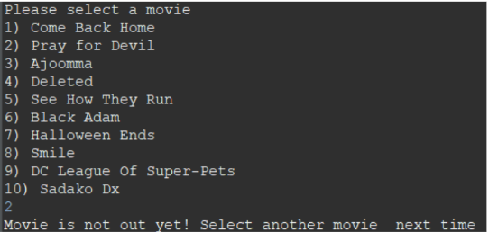

# SC2002-OOP-Project

## Problem Definition
Design an Cinema Online Booking and Purchase System for users and admin for admistration purposes using JAVA Object Oriented Programming Language .

## About

This is a project for Nanyang Tehcnological University SC2002 Object-Oriented Design & Programming.  
*MOBLIMA* is an application to computerize the processes of making online booking and purchase of movie tickets, listing of movies. It will be used by the moviegoers and cinema staff. Different features are implemented as below:

1. [Portal Selection]   Select if the user is Customer or Admin.
  
3. [Movie-Goer Account Registration]  Register Movie-Goer account for booking cinema movie.
  
5. [Movie-Goer Account Login]  Login to existing Movie-Goer Account to perform following actions.
  
6. [Movie Listing]  View list of movies available.
  
7. [Search Movie]  Search a particular movie using Movie name.
  
8. [View Movie Details]  Access Movie details such as directors, casts, airing date etc.
  
9. [Book Movie]  Book a movie.
  
10. [Seat Selection/Unselection]  Select the seat in a cinema.
  
11. [Payment]  Make payment to the movie booking.
  
12. [View Booking History]  View the history of booking.
  
13. [Give Review]  Give a review to a particular movie.
  
14. [Admin Login]  Admin login for administration purpose as follows.
  
15. [Create/Update/Remove Movie Listing]  Update the current available movie listing.
  
16. [Create/Update/Remove ShowTime]  Update showtime for a particular movie.
  

## What did we learn from this project?

- SOLID Design Principle to ensure easy system maintanence, editability and extendability.
- Object Oriented Concepts in implementing complicated system designs.
- UML Class Diagram
- Object Oriented Programming in JAVA
- System Testing

## Contributors

- Lim Jun Hern
- Leong Hong Yi
- Leong Kai Fong
- Tan Jing Han
- Tan Kok Ann Jeff

## Note
* The `.dat` file in this repository is slightly different from what we used at the start of the demo video
* Cineplexes, cinemas will be initialized by the `DataStore` class if the `.dat` file is not found
    * Currently, 10 default movies will be initialized by the `DataStore` class as well

## Admin Account
* Username: `admin`, Password: `admin123`

## MovieGoer (User) Account
* To be created by typing in the email, name and phone number upon first time login as a moviegoer
* Subsequent login by typing the same email will bring user back to the same account created previously

## How to view docs
* Open doc/index.html in a web browser
